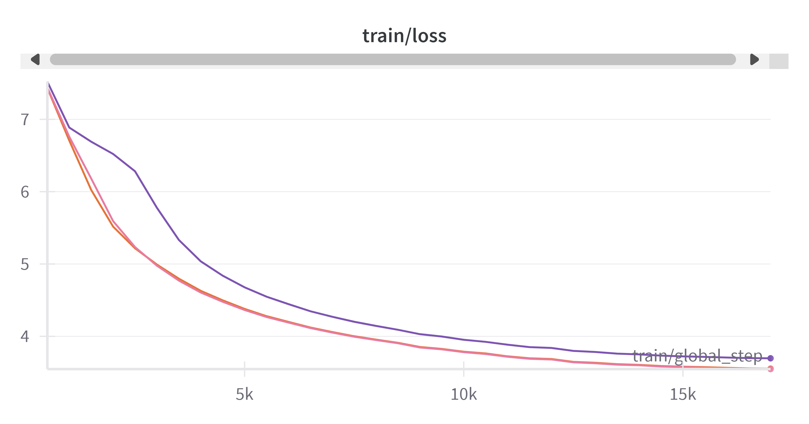
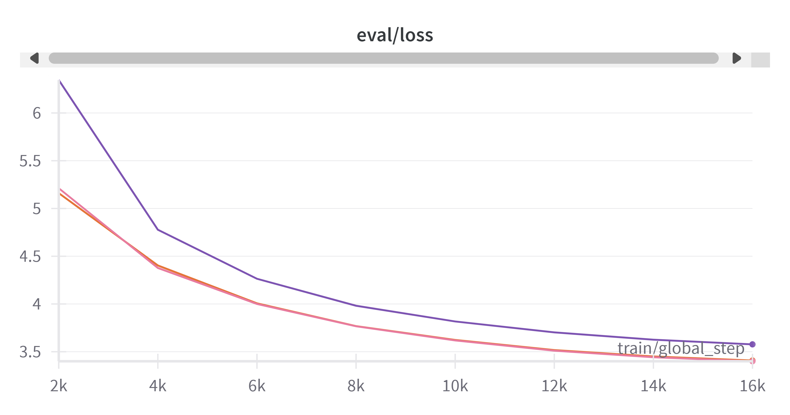
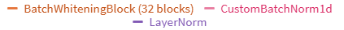

# Batch Whitening for NLP  

This document outlines the current status of integrating the Batch Whitening (BW) layer into NLP models. The BW layer is intended to replace the Layer Normalization (LN) layer, with the goal of achieving faster convergence during training. This improvement can manifest in one of two ways:  

1. Faster convergence to a lower training loss.  
2. Better generalization, meaning improved loss or accuracy on the validation/test set.  

### Code References  
- The source code is available here: [Batch Whitening NLP](https://github.com/guyknvda/batch_whitening/tree/main/nlp/nano_gpt).  
- The BW layer implementation is located in: [model.py (line 108)](https://github.com/guyknvda/batch_whitening/blob/main/nlp/nano_gpt/model.py#L108).  
- The core BW function, `batch_orthonorm()`, is where the whitening process takes place.  

### BW Implementation in NLP  

**No running cov:**   
The BW layer is implemented without maintaining historical statistics, similar to LN. This means that only the current batch’s statistics are considered, and there are no updates to `running_cov`. Consequently, the same code is used for both training and inference.  

We observed that when historical statistics were incorporated, model performance deteriorated:  
- Training loss improved, but validation performance diverged significantly.  
- Without history, results were more stable, and training/validation behavior was consistent.

**Block diagonal cov:**  
Another supported feature is the use of a block diagonal covariance matrix instead of a full covariance matrix.  
The number of blocks can be adjusted by modifying the hardcoded value `32` in [model.py (line 39)](https://github.com/guyknvda/batch_whitening/blob/main/nlp/nano_gpt/model.py#L39). This parameter directly impacts the error.  
The input `X` to the BW layer has dimensions `[B, T, C]`, corresponding to `[batch, time, channels]` or `[batch, seq, hidden]`. In NLP models, particularly GPT-based and BERT-based architectures, these dimensions remain consistent across all BW layer calls.  
The error is given by:  
$ e \approx \sqrt{\frac{C^2}{2V}} $.  
Using a block diagonal approach with block size $ c < C $ effectively reduces the number of channels from $ C $ to $ c $, thereby decreasing the error.

## Testing BW in NLP Models  

### GPT-2  
We tested BW with GPT-2, using code adapted from [nanoGPT](https://github.com/karpathy/nanoGPT/tree/master).  
- To train GPT-2 with BW: [train.py](https://github.com/guyknvda/batch_whitening/blob/main/nlp/nano_gpt/train.py).  
- To train GPT-2 with the original LN layer, modify [train.py (line 62)](https://github.com/guyknvda/batch_whitening/blob/main/nlp/nano_gpt/train.py#L62) by replacing `'True'` with `'False'`.  

**Findings:**  
During training, both training and validation loss approached zero, suggesting extremely good performance. However, the generated output was gibberish.  

Upon investigation, we discovered that our BW implementation unintentionally allowed the model to access future tokens while predicting the next word. This violates the core principle of autoregressive language models, which should only use past tokens during training.  
At inference time, the model correctly relied only on past tokens, leading to nonsensical output despite the seemingly perfect training loss.
We confirmed this unintended access to future tokens using the [check_future_leaking.py](https://github.com/guyknvda/batch_whitening/blob/main/nlp/nano_gpt/check_future_leaking.py) script, which verifies the issue.  

To address this problem in autoregressive language models, the proposed solution is to compute a separate covariance matrix for each token, using only tokens from other sentences within the batch.  
Consider a batch containing *n* sentences, each with *k* tokens. This results in *kn* token vectors. From each token, we can construct a matrix, and averaging these matrices yields the covariance matrix.  
For each token in the batch, we exclude its own sentence and compute the covariance matrix using the remaining *k(n-1)* vectors—i.e., the average of *k(n-1)* matrices.

This solution may introduce a significant computational overhead, and we have not yet tested its feasibility.

### RoBERTa  
We also tested BW with the RoBERTa model. Unlike GPT, RoBERTa does not suffer from the issue of accessing future tokens. Since it is a decoder model, training involves a masking technique where the model learns to predict a masked word using the surrounding context—both preceding and following words are visible.  

Each time the BW (or original LN) layer is called, the input `X` has the shape `[64, 128, 768]`, corresponding to `[B, T, C]`.  
Thus, `batch_orthonorm()` operates on an input of shape `[64, 128, 768]`. After flattening `B` and `T`, we obtain a matrix of shape `768 × 8192`, leading to a covariance matrix of size `768 × 768`.  
The expected error is estimated as:  
$ e \approx \sqrt{\frac{C^2}{2V}} $.  
For the full covariance matrix:  
- $ C = 768 $, $ V = 64 \times 128 = 8192 $  
- Resulting error: $ e \approx 6 $ (a high error).  

When using a block diagonal covariance instead:  
- With `num_groups = 128` (group size = 6): $ C = 6 $, $ V = 8192 $ → $ e \approx 0.05 $.  
- With `num_groups = 32` (group size = 24): $ C = 24 $, $ V = 8192 $ → $ e \approx 0.2 $.  

We trained RoBERTa with BW using 32 groups (hardcoded in [model.py (line 39)](https://github.com/guyknvda/batch_whitening/blob/main/nlp/nano_gpt/model.py#L39)) and compared its performance to both the original LN and `BatchNorm1d`.
To train the model, run the script [train_roberta.py](https://github.com/guyknvda/batch_whitening/blob/main/nlp/roberta/train_roberta.py).  
To switch between LN, BW, and `BatchNorm1d`, modify the hardcoded value of the `type` parameter in [train_roberta.py (line 117)](https://github.com/guyknvda/batch_whitening/blob/main/nlp/roberta/train_roberta.py#L117), changing it between `'BatchWhiteningBlock'`, `'CustomBatchNorm1d'`, and `'LayerNorm'`.

The results showed that BW outperformed LN on both the training and validation sets, but its performance was comparable to that of `BatchNorm1d`.
See the learning curves in Figure 1 and Figure 2:  

**Figure 1: Training Loss**  

**Figure 2: Validation Loss**  

## Next Steps  
- Replace hardcoded values with configurable parameters, allowing them to be set via command-line arguments when running the training script.  
- TBD

